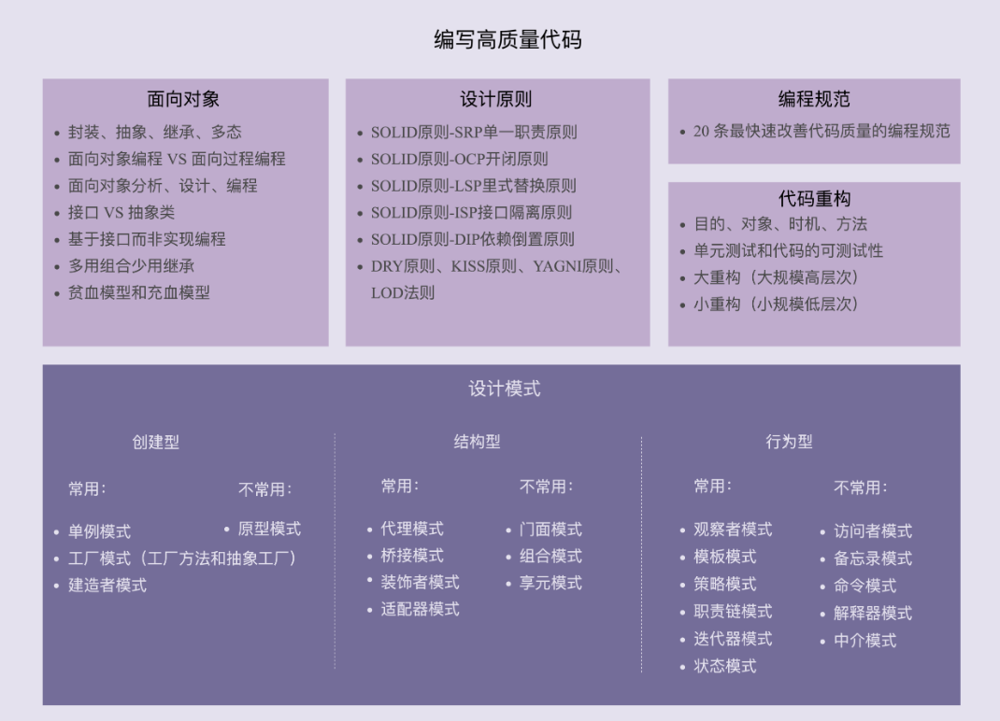

## 面向对象

1. 面向对象的四大特性:封装,抽象,继承,多态
2. 面向对象和面向过程的联系与区别
3. 面向对象分析,面向对象设计,面向对象实现(编程)
4. 接口类和抽象类的使用场景
5. 基于接口设计而非实现的编程
6. 多用组合少用继承 (Golang 的设计思想)
7. 面向过程的贫血模型和面向对象的充血模型

## 设计原则

1. 单一职责原则
2. 开闭原则
3. 里氏替换原则
4. 接口隔离原则
5. 依赖倒置原则
6. DRY 原则,KISS 原则,YANGI 原则,LOD 法则

* DRY 原则(Don't repeat yourself):尽量编写可复用的代码,减少重复代码
* KISS 原则(Keep it simple stupid):编写简洁性高的代码
* YANGI 原则(You ain't gonna need it):只着眼必须的功能,而不要添加其他非必须的实现
* LOD 法则:减少类与外部之间的沟通,类与类之间避免直接的交流

## 设计模式

设计模式最 "常用" 的有 23 种,这个数字在不断的变化.

有些设计模式被列为 "反模式" 如单例模式.

有些设计模式被内置到编程语言里面,如迭代器模式.

有些设计模式在不断地产生,如 Monostate 单一状态设计模式(与单例模式很类似)

常用的设计模式可以分为三大类型:创建型,结构型,行为型

### 创建型设计模式

常用的:单例模式,工厂模式(工厂方法,抽象工厂),建造者模式
不常用的:原型模式

### 结构性设计模式

常用的有:代理模式,桥接模式,装饰者模式,适配器模式
不常用的有:门面模式,组合模式,享元模式

### 行为型设计模式

常用的有:观察者模式,模板模式,策略模式,职责链模式,迭代器模式,状态模式
不常用的有:访问者模式,备忘录模式,命令模式,解释器模式,中介模式

