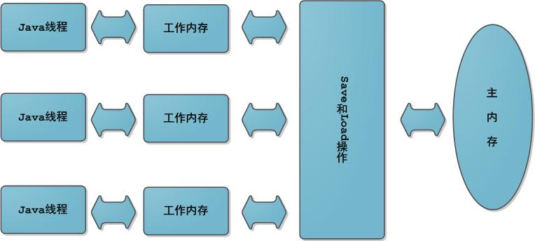

## 1. 并发编程中的三个基本概念

### 1.1 原子性
原子性：一个或多个操作，要么全部执行成功，且不会被任何其他因素打断，要么全部执行失败。不会出现一些成功一些失败的情况，这样的若干个操作被称作原子性。

有点类似于事务的概念。

A有1000块，B有2000块，A给B转账500，分两个步骤：
1. A减去500块，还剩500
2. B加上500块，还剩2500

如果第一步失败了，那么A还是原来的1000块不变，但是第二步成功了，那么B会凭空多出来500块

可见这两步并不是原子性的，因为有些步骤成功了，有些步骤失败了

### 1.2 可见性
可见性：当多个线程访问同一个变量时，其中一个线程修改了这个变量后，其他线程能够立马发现这个变化。

这里需要略微了解下java的线程内存模型：

可以看到，每个线程都有自己独有的 *工作内存* ，这里也可以简单理解为线程自己的 *私有变量* ，私有变量只有当前线程才能访问，其他线程没有访问权限。

而线程又是被进程创建出来的，所以进程也有自己的 *工作内存* ，通常称进程的 *工作内存* 为 *主存* ，由于子线程能够共享父进程的内存空间，所以进程的 *主存* 能够被其所有子线程访问到。

我们定义的变量，通常都是存放在 *主存* 中的，所以线程想要修改一个变量，需要经过以下几个操作：
1. 从 *主存* 中拷贝一份数据到自己的 *工作内存* 中
2. 修改自己的 *工作内存* 中的数据副本
3. 把 *工作内存* 的数据副本写回 *主存* 
