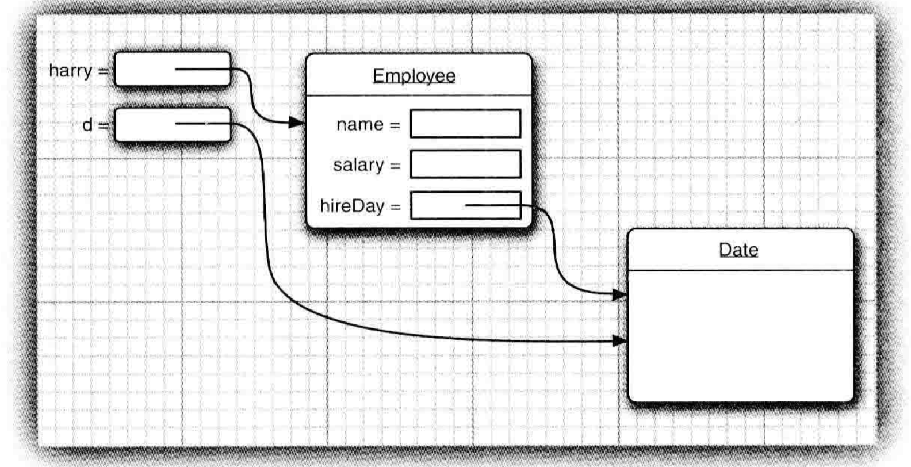

# 1. OOP

# 1.1 封装

当我们在为类的属性编写访问器方法 `(即gette和setter方法)` 时，要注意不能编写返回可变对象的访问器方法。

例如：
```java
class Employee{
    private Date hireDay;
    
    public Date getHireDay(){
        return hireDay;
    }
}
```

需要注意的是，`LocalDate` 类没有更改器方法，而 `Date` 有一个 `setTime()` 方法用于设置毫秒，所以说 `Date` 对象是可变的，这破坏了类的封装性。请看下面代码。
```
Employee harry;
Date d = harry.getHireDay();
d.setTime(d.getTime() - (long) 365 * 24 * 60 * 60);
```



上述代码中，`harry` 实例的 `hireDay` 和外部 `date` 此时都指向了同一个对象，导致外部可以不通过调用对象的访问器方法直接修改对象属性的具体值，这就破坏了类的封装性。

如果需要返回一个可变对象，那么返回的应该是它的克隆 `(clone)` 对象

例如：
```java
class Employee{
    private Date hireDay;
    
    public Date getHireDate(){
        return (Date)hireDay.clone();
    }
}
```

## 1.2 final实例域

构造对象时必须初始化设置 `final` 修饰的属性的值，也就是说，在每一次构造器执行之后，这个域的值将被设置，并且在后面的过程中不能在对它进行修改。

`final` 关键字通常用于修饰不可变的值或者类，例如 `String` 类，对于可变的类使用 `final` 修饰则可能造成读者的混乱。

例如：
```
private final StringBuilder evaluation;
```
在构造器中会被初始化：
```
evaluation = new StringBuilder;
```

`final` 只表示 `evaluation` 所指的对象不会被修改为其他的 `StringBuilder` 对象，并不是表示当前的对象的值不能在改变。

以下代码任然是合法的：
```
evaluation.append("LocalDate.now" + ": Gold star";
```

## 1.3 static静态域

如果将域定义为 `static` 的，那么这个类的每个对象将共享这个域，即使这个类没有实例被创建，这个域也是存在的。静态域是属于类的，不属于任何实例。

### 1.3.1 static 静态常量

单独的静态域用得比较少，使用的更多的是静态常量 `static final` 

例如：
```java
public class Math{
    public static final double PI = 3.1415926;
}
```

在外部我们可以使用 `Math.PI` 直接使用这个常量，而不是通过 `Math` 的某个实例去单独调用，因为这个 `PI` 变量是属于 `Math` 类的，而不是属于某个实例的。

*另一个使用的比较多的静态常量是 `System.out` ，其实在 `System` 类里面有个 `setOut()` 方法，这个方法可以把 `out` 设置为其他流。但是为什么一个被定义为 `final` 的变量却可以被修改。这是因为 `setOut()` 方法是一个本地方法，它不是由 `Java` 语言实现的，所以本地方法可以绕过 `Java` 语言的存取控制。这是一种特殊的方法，在我们实际编程中不推荐这样的写法。*

### 1.3.2 静态方法

被 `static` 修饰的方法叫做静态方法，静态方法是不能够向对象实施操作的方法。

例如：
```
Math.pow(x,a);
```

这个方法用于计算 `x^a` 的结果，而这个计算过程是不需要使用任何 `Math` 类的对象，换句话说就是没有 **隐藏参数** 

静态方法是不能使用类中的非静态实例域的，只能使用类中的静态域

### 1.3.3 工厂方法

工厂方法是静态方法的另一种用处。

* 当我们想要得到的实例名字不一样，然而构造方法必须与类名相同，所以就无法确定构造方法的名字。
* 使用构造方法时，无法改变所构造的对象类型。

## 1.4 方法参数

* 传值：即方法接收的是调用者提供的 **值**

* 传引用：即方法接收的是调用者提供的 **变量的地址**

`Java` 语言总是按照 **传值** 调用的，也就是说方法的到的永远是一个参数的拷贝对象，特别的是方法是不能修改传递给它的任何参数的内容。

