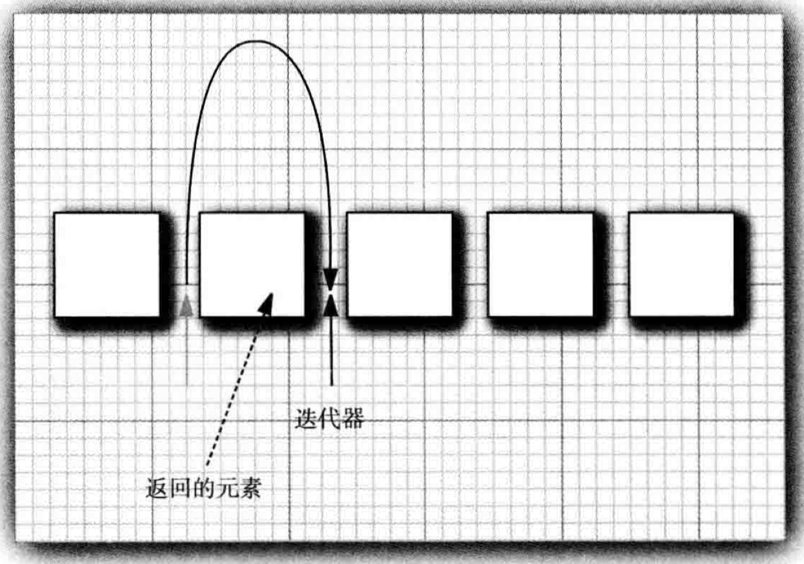

# 1. 集合

集合的提供了一个迭代器 `Iterator` 用于遍历集合中的每一个元素，但是 `Java` 的迭代器不像 C++ 中是类似于数组下标来建立索引的。简单来说，`Java` 的迭代器是位于当前元素和下一个元素之间的，每次调用 `next()` 方法时，将会返回跨过的那一个元素，例如下图：


如果要删除一个元素，在调用 `remove()` 方法之前，仍然需要先调用 `next()` 越过待删除的元素后才能删除掉该元素。而且这两个方法是互相依赖的，也就是说每次删除元素之前，都必须要先调用 `next()` 跨过这个元素。

## 1.1 增删和访问操作

对于 `List` 来说，最常用的两个实现则是 `LinkedList` 和 `ArrayList`。

1. 前者在增删操作上有着更好的性能，因为链表只需要操作指针的指向即可，值得说明的是 `Java` 中的链表是 **双向链表** 。如果通过迭代器向链表中删除元素，一样需要先通过 `next()` 方法越过待删除的元素，然后再调用 `remove()` 方法去删除元素。

`add()` 方法只依赖于迭代器的位置，它向迭代器的下一个位置插入元素。

`remove()` 方法则同时依赖于迭代器的位置和状态，如果是先调用的 `next()` 方法，那么删除的是迭代器左侧的元素。然而如果是先调用的 `previous()` 方法，则删除的将会是迭代器右侧的元素。

2. 后者在随机访问上有着更好的性能，因为对于数组来说只需要通过下标即可访问任何位置的元素。

## 1.2 迭代器混用

如果两个迭代器同时操作一个集合，此处并非特指并发的情况下，即使是在单线程下，例如下列代码：
```
List<Integer> intList = new ArrayList();
intList.add(1);
intList.add(2);

Iterator<Integer> i1 = intList.listIterator();
Iterator<Integer> i2 = intList.listIterator();

i1.next();
i1.remove();
i2.next(); // 两个迭代器同时操作一个集合，后一个迭代器会抛出异常
```