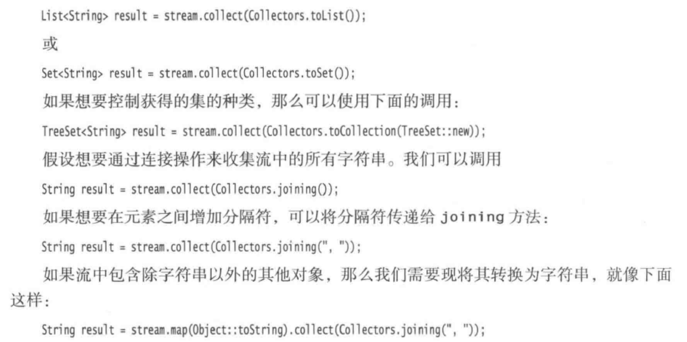

# 1. 流

流和集合的差异性：

1. 流并不存储元素，要么是存储在底层的集合中，要么是按需生成

2. 流的操作不会修改数据源，`filter` 操作是生成一个新的流，而不是操作原来的数据源。

3. 流的操作是惰性的。意思就是说直到需要其结果时，才执行操作。

## 1.1 无限流

使用 `Stream` 类中提供的 `Stream.generate` 或者 `Stream.iterate` 静态方法去创建一个流。但要注意的是，如果是创建的一个无限流，那么必须配合 `limit` 进行截断，否则就一直无限下去了。

例如，生成一个含有一百个随机数的流：
```
Stream.generate(Math::random).limit(100).forEach(System.out::println);
```

而 `skip` 则会跳过流的前n个数据，如果操作的是无限流，跳过前n个数据后任然是无限流，还是需要进行截断。

使用 `concat` 将两个流拼接起来，但是第一个流不能是无限流，否则操作会无限制进行下去。

## 1.2 关于流的一些其他操作

1. `distinct` 将原来的流按照原来的顺序去重后生成新的流。

2. `sorted` 对于流的排序来说，有很多变种的自定义排序规则。其中一种用于操作 `Comparable` 元素的流，而另外一种则用于接受 `Comparator` 。

## 1.3.1 惰性操作

即按照某些规则去处理一个流，但是返回的结果任然是一个流，而不是具体的值，比如说 `map` 、 `filter` 等操作。

## 1.3.2 及早求值

即从流中获取最终需要的数据，比如说 `count` 、 `max` 、 `min` 等操作。这些操作会从流中返回具体的值，而不再是一个流了，也就不能再对原来的流进行操作了。

对于及早求值，常用的有以下几个操作:

1. `count` 、 `max` 、 `min` ：分别返回当前操作流的元素个数，最大元素和最小元素。

2. `findFirst` 、 `findAny` ：分别返回第一个符合条件的，或者返回任何一个符合条件的元素。后者处理并行流的时候有很大的用处，因为流可以报告它任何找到符合条件的元素，而并非限制到第一个元素。

3. `anyMatch` 、 `allMatch` 、 `noneMatch` ：分别在存在元素、所有元素、和没有元素使得后面断言成立的时候返回 true 

## 1.4 Optional

上面的1，2操作的返回值其实均是 `Optional<T>` 对象，这个对象在处理 `null` 情况下时更加安全。

使用 `Optional` 类的一个关键点就是，它会在返回值不存在的时候用一个可替代物去代替空指针，而在值存在的时候才会去使用这个值，这样可以避免空指针的异常发生。

### 1.4.1 构造方法

在使用 `Optional` 对象之前，先了解一下它的三个构造方法：

1. Optional.of(obj)：要求传入的 `obj` 对象明确的不为 `null` ，否则会立马抛出一个 NPE 异常。

2. Optional.ofNullable(obj)：接受任何对象，如果为 `null` 则返回 `Optional.empty()` ，否则返回 `Optional.of(obj)` 。

3. Optional.empty()

哪为什么不在所有情况下都是用第二个构造方法一劳永逸呢？

1. 因为有时候我们非常明确的将一个非空对象传递给 `Optional.of(obj)` ，例如：`Optional.of(new demo.Person())` ，或者是一个字符串常量。

2. 需要明确地指出存在 `NPE` 异常，即万一 `obj` 为 `null` 了，我们希望立即得到一个空指针异常，而不是把它隐藏到 `Optional.ofNullable(obj)` 之中。

### 1.4.2 如何优雅地使用Optional对象

对于传统的方法：
```
User user = .....
if(user == null){
    return "";
}
else{
    return user.getUsername();
}
```
如果我们简单地使用 `Optional` 对象时，很容易地写出以下代码：
```
Optional<User> optionalUser = .....
if(optinalUser.isPresent()){
    return optinalUser.get().getUsername();
}
else{
    return "";
}
```
可以说我们的思维方式任然在原地踏步，没有得到任何进步，只能简单的认为它是 `User` 类的一个简单包装。

直白的讲, 当我们还在以如下几种方式使用 Optional 时, 就得开始检视自己了

1. 调用 `isPresent()` 方法时。

`isPresent()` 与 `obj != null` 无任何分别, 我们的生活依然在步步惊心，时刻担心着空指针的出现。

2. 调用 `get()` 方法时。

在没有 `isPresent()` 做铺垫的时候，直接调用 `get()` 方法，我们会收到一个来自编译器的警告。

3. `Optional` 类型作为类/实例属性时。

4. `Optional` 类型作为方法参数时。

把 `Optional` 类型用作属性或是方法参数在 `IntelliJ IDEA` 中更是强力不推荐的：

**使用任何像 `Optional` 的类型作为字段或方法参数都是不可取的. `Optional` 只设计为类库方法的, 可明确表示可能无值情况下的返回类型. `Optional` 类型不可被序列化, 用作字段类型会出问题的.**

综上所述，我们在使用 `Optional` 对象的时候，应当避免使用 `isPresent()` 或者 `get()` 方法，而是依赖于其他更加合适的方法：

1. 当对象不存在时，返回默认值对象或者空串：
```
return optionalUser.orElse("");
// 或者不存在时返回默认值对象
return optinalUser.orElse(DEFAULT_USER);

// 而不是 return optionalUser.isPresent() ? optionalUser.get() : null;
```

2. 对象存在则返回，否则使用方法去构造一个新对象：
```
return optionalUser.orElseGet(() -> UserFactory.initUser())

// 而不是 return optionalUser.isPresent() ? optionalUser.get() : UserFactory.initUser();
```

3. 存在才对它做点什么

`ifPresent(e -> Process e)` 方法接受一个函数，如果可选值存在则把这个值传递给函数，否则不做任何事。

```
optionalUser.ifPresent(e -> System.out.println(e.getUsername()));

// 而不是
if (optionalUser.isPresent){
    System.out.println(optionalUser.get().getUserName());
}
```

4. 使用map方法去获得与之关联的集合对象

这里我们假设 `user` 对象有着一个身份标签，表示了用户拥有的所有身份，如果用户存在，则返回这个标签的集合，如果不存在，则返回空集合

```
return optionalUser.map(e -> e.getRoles()).orElse(Collections.emptyList());

// 而不是
if (optinalUser.isPresent()){
    return optinalUser.get().getRolese();
}
else{
    return Collections.emptyList();
}

```
这里的 `map` 是无限级联的，例如我们我们需要返回用户名的大写形式：
```
return optionalUser.map(e -> e.getUsername()).map(name -> name.toUpperCase()).orElse(null);
```

## 1.5 收集流的结果

在处理完流之后，我们需要查看最终流的结果，常规方法是调用 `iterator()` 方法去产生用于访问的迭代器。

也可以使用 `forEach()` 以任何顺序去遍历流中的每一个元素，如果需要按照一定的顺序去遍历元素的话，则可以调用 `forEachOrdered` 去按照一定顺序遍历流，但是这样做会失去部分并行流带来的优势。

对于表达式 `stream.toArrar()` 来说，由于无法在运行时创建泛型数组，所以这个表达式会返回 `Object[]` 对象，如果我们需要确切的类型，则可以将它传递到数组的构造器中，例如：
```
String[] result = stream.toArray(String[]::new);
```

对于收集元素来说，有一个更加简便的方法，即 `collect()` ，它接受一个 `Collectors` 接口的实例，以下是常用方法：



## 1.5.1 收集到Map中

使用 `Collectors.toMap()` 将流中的元素按照某种映射关系，声称对应的 `Map` 集合。

[Function详解](https://blog.csdn.net/u012843361/article/details/82142482)

## 1.5.2 简约操作

`reduce()` 方法是用于从流中计算某个值得通用机制，其最简单的形式就是接受一个二元函数，并且从流中前两个元素开始持续应用它。

例如：
```
List<Integer> list = ...;
Optional<Integer> sum = list.stream().reduce((x, y) -> x + y);
```
上面方法中 `reduce` 会依次计算 v0 + v1 + v2 + .... 如果流为空，那么该方法会返回一个 `Optional` 对象。

需要注意的是，`reduce` 方法接受的计算函数必须是 **可结合** 的，用数学的标记来解释就是必须满足：`(x op y) op z = x op (y op z)`

通常会有一个幺元值 `e` 使得 `e op x = x`，对于加法来说，**0** 就是这个幺元值。所以 `reduce()` 方法可以如下写作：
 
```
List<Integer> list = ...;
Optional<Integer> sum = list.stream().reduce(0, (x, y) -> x + y);
// 0 + v0 + v1 + v2 + ....
```
如果流为空的话，就返回这个幺元值。
