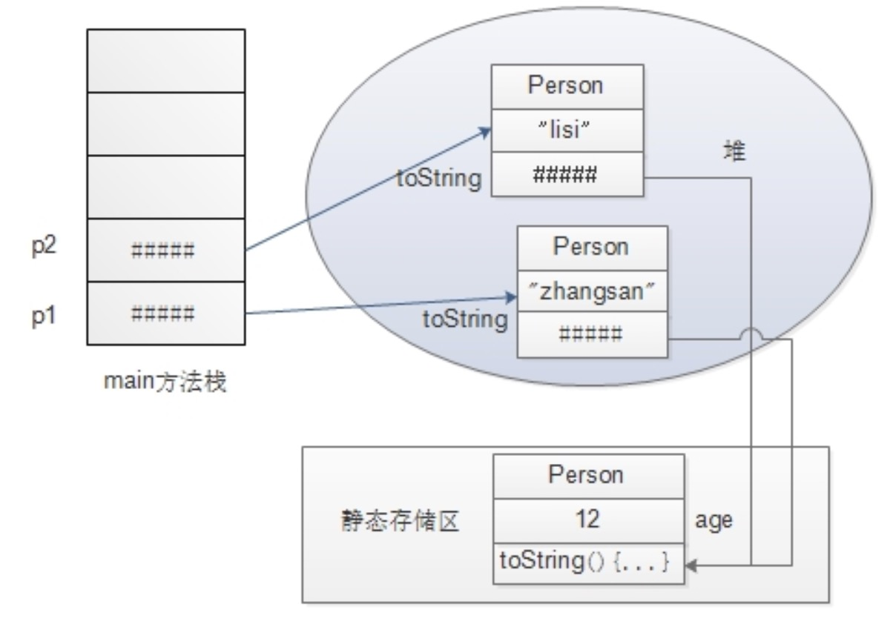

# static 关键字

## 1 修饰变量和方法

`static` 关键字最常用的就是用来修饰成员变量和方法，静态的成员变量和方法是属于类级别的，也就是说静态成员是类成员，而非实例独有的实例成员。

每次 `new` 出的实例，都独有的包含了自己的实例成员，实例彼此的成员是互不干扰的，他们都存放于堆内存<sup>[1]</sup>中。

如果类中有被 `static` 修饰的成员，那么这些成员都被存放在静态存储区<sup>[2]</sup>中。



可以看到 `new` 出来的每个实例所包含的静态成员，都是指向了同一块内存上存放的 **静态方法** 。

## 1.1 修饰成员变量

如果在 `p1` 中修改了静态成员变量 `age` 的值，那么在 `p2` 中同样也会被影响的。静态成员不再属于某个实例，而是统一交给这个类去管理，所以称静态成员是 **类成员** ，而非 **实例成员** 。

由于公有的静态成员变量可以被每个类访问，有时候这么做会显得非常的混乱，因为每个实例都可以修改静态成员变量，而且其他实例都会因此受到影响。

更安全的共享静态成员的做法如下：
```
public class demo.Person{
    private static int count;
    ....

    public demo.Person(){
        count++;
    }

    public int getCount(){
        return count;
    }
}
```
这样的类计数器共享方式会更加安全，因为静态成员被 `private` 修饰，在外部无法随意访问。

## 1.2 修饰成员方法

修饰成员方法和成员变量并没有太大区别，唯一一点就是静态的成员方法可以直接通过 **类名.方法名** 直接调用。

对于一些工具类来说，为了避免频繁的创建出对象而消耗过多的资源，我们可以将这些工具类中的方法定义为 `static` 静态的，这样外部类就可以直接通过类名+方法名直接调用。

当然静态成员方法也有一定的局限性：静态方法不能访问非静态的变量或者非静态的方法。

因为静态方法和静态变量在类被定义的时候就已经加载好了，而此时都没有实例被 `new` 出来，又怎么能去掉用实例的方法呢。就算已经有实例被 `new` 出来了，那么静态方法也将不知道具体访问哪个对象的变量或者方法。

# 2 静态块

在类第一次被调用或者初始化之前，会首先初始化类的静态块，也就是由 `static` 声明的代码块。

## 2.1 类的初始化顺序

1. 通用的初始化顺序 

静态代码块 (每个类只初始化一次静态代码块) >> 静态成员 >> 成员变量 >> 构造代码块 (类每次被构造的时候执行) >> 构造方法 >> 成员方法

2. 含有继承关系的构造方法初始化顺序如下：

父类的成员变量 >> 父类构造方法 >> 子类成员变量 >> 子类构造方法 >> 父类/子类成员方法

3. 有继承关系的父类和子类的成员变量、静态代码块、构造代码块、构造方法，成员方法的初始化过程

父类静态代码块 >> 子类静态代码块 >> 父类构造代码块 >> 父类构造方法 >> 子类构造代码块 >> 子类构造方法

**比较下这个：
Java程序初始化的执行顺序：父类静态变量—>父类静态代码块—>子类静态变量—>子类静态代码块—>父类非静态变量—>父类非静态代码块—>父类构造方法—>子类非静态变量—>子类非静态代码块—>子类构造方法**

# 3 静态导入

在 `JDK1.5` 以后引入了一个新特性：静态导入。例如：

```
import static java.lang.System.*;

public class Test {
    public static void main(String[] args) {
        out.println("hello static");
    }
}
```

这里将 `System` 类下的所有静态成员全部导入了，这样在类外部可以直接使用该类的静态成员，在调用方法的时候也不需要使用 **类名.方法名** 了。

参考资料：  
[[1] 堆内存 # 3](./Java存储数据的不同方式.md)  
[[2] 静态存储区 # 4](./Java存储数据的不同方式.md)
