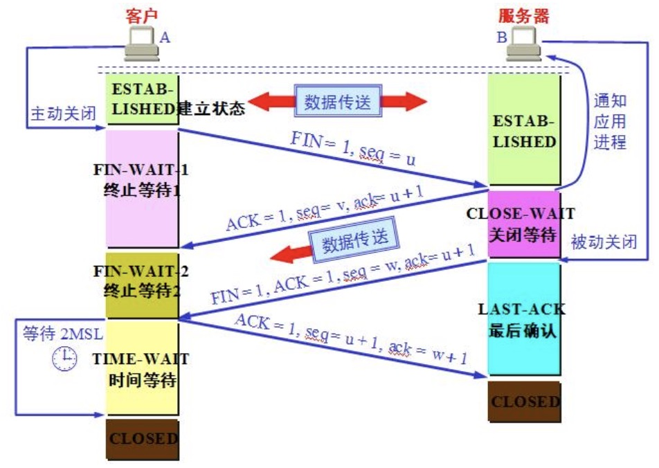

## 1 TCP四次握手

tcp关闭连接时四次握手示意图：


## 2 网络延迟

网络延迟具体指的是：指报文从进入网络到离开网络所耗费的时间


## 3 七层网络架构

从下往上分别是：
```
物理层 -> 数据链路层 -> 网络层 -> 传输层 -> 会话层 -> 表示层 -> 应用层。
```

1. 物理层涉及在信道上传输的原始比特流。

2. 数据链路层的主要任务是加强物理层传输原始比特流的功能，使之对应的网络层显现为一条无错线路。发送包把输入数据封装在数据帧，按顺序传送出去并处理接收方回送的确认帧。

3. 网络层关系到子网的运行控制，其中一个关键问题是确认从源端到目的端如何选择路由。

4. 传输层的基本功能是从会话层接收数据而且把其分成较小的单元传递给网络层。

5. 会话层允许不同机器上的用户建立会话关系。

6. 表示层用来完成某些特定的功能。

7. 应用层包含着大量人们普遍需要的协议。