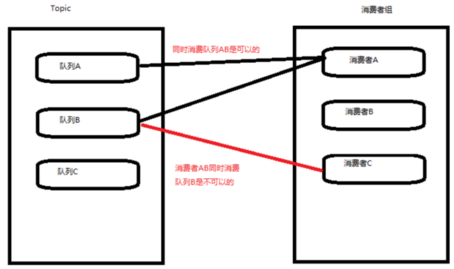
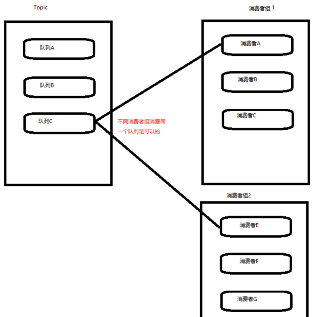
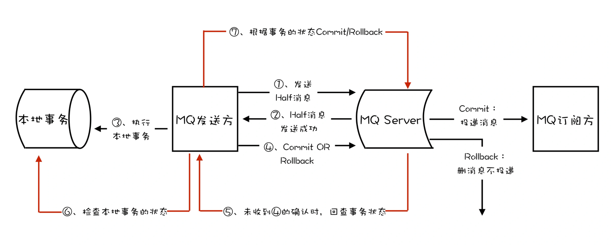

## 消息队列的模型演进

### 队列模型

早期的消息队列完全是参考了 **队列** 这一数据结构,严格按照 FIFO 的方式存储和处理数据

`生产者` 将消息投递到队尾

`消费者` 从队头消费消息

弊端:

如果有多个消费者同时订阅一条队列,那么这些消费者互为 **竞争关系** ,因为一条消息只能由一个消费者消费

极端场景下,有些消费者可能会被 **饿死**

如果业务要求每个消费者都必须获得全量的消息,那只能每个消费者单独配置一条消息队列; 从而导致生产者需要将同一条消息投递给多个消息队列

这增大了生产者的压力

### 发布/订阅模型

为了解决多个消费者消费同一个消息的问题,引入 **发布/订阅** 机制

生产者变为 `发布者(Publisher)`, 消费者变为 `订阅者(Subscriber)`, 消息队列变为 `主题(Topic)`

订阅者在消费消息之前,必须要订阅某个主题才行,在每个订阅当中,订阅者都能完整的接收主题的所有消息

### 区分 "队列模型" 和 "发布/订阅模型"

有一个关键点:就是同一条消息,能否被多个消费者消费到; 即消息能否重复消费

### RabbitMQ 仍然坚持使用 "队列模型"

但是 RabbitMQ 支持一条消息的重复消费,是因为其引入了一个 `Exchanger` 的模块

其功能和作用类似于一个 **路由器** 或者 **交换机**

生产者只关心将消息投递到 `Exchanger` 里面去,而 `Exchanger` 维护了一个路由表

路由表决定了将消息投递到哪些队列当中去,这样就通过路由表的配置实现了同一条消息投递到多个消息队列完成重复消费的动作

### RocketMQ 则是标准的 "发布/订阅模型"

消息队列有个很关键的问题就是: 如何保证消息的正确投递,不受到网络或者其他因素的干扰导致消息投递失败?

几乎所有消息队列都采用一个朴素的 **请求-确认** 机制来保证消息的正确投递

其具体做法也很简单:

生产者将消息发送给服务端,也就是 `Broker`, 服务端在收到消息后,将消息写入 `Topic` 或者 `Queue` 当中,然后给生产者回一个 **确认** 的响应

如果生产者在一定时间内没有收到来自服务端的 **确认** 或者 **失败** 的响应,就会尝试重新发送消息

在消费端,也是在一条消息被正确消费后,会给服务端回一个 **确认** 的响应

服务端如果在一定时间内没有收到来自消费端的 **确认** 或者 **失败** 的响应,就回尝试重新将消息发送给消费端

这种类似 `ack` 的做法会带来什么问题?

由于队列是有序的,然而上一条消息没有成功消费的话,队列当中下一跳消息就无法被消费; 否则就会产生消息空洞),违背了时序的连续性

导致同一时间内,一个主题最多只有一个消费者在进行消费,无法通过横向扩展消费者的数量来提高消费性能

### RocketMQ 的 "队列" 模型

为了实现多个消费者并行消费同一个主题下的消息,RocketMQ 引入了 **队列** 这个概念

RocketMQ 的主题是由多个 **队列** 构成, 以此来实现消息的并行生产和消费

注意: RocketMQ 对于消息的有序性仅仅在 **队列** 上得到保证,在主题上无法保证有序性

订阅者则是通过 `Consumer Group` 来组织的,每个消费组都有一份来自主题的完整消息,不同的消费组之间的消费进度完全不受影响

也就是说对于同一个消费组内的所有消费者,他们是互相处于竞争状态的; 一条消息被组内的 C1 消费了,那么就不能够被同组内的 C2 再次消费

在 `Topic` 消息被消费时,由于需要被不同的订阅者(消费组)进行多次消费,所以主题内的消息在被消费后并不会立即删除掉

RocketMQ 在每个队列上维护一个 **消费位置** 的概念,在 **消费位置** 之前的消息是已经被消费了的,之后的消息是还未被消费的

### 消费者,消费者组,队列的关系

对于同一个消费组之内的消费者来说,可以同时消费主题当中的多个队列

但是你不允许多个消费者同时消费同一个队列

不同的消费组之间的消费者,可以同时消费主题当中的同一个队列(其消费进度完全独立维护,互不影响)

### Kafka 的 "分区" 模型

RocketMQ 的每一个概念都可以完全套用到 Kafka 当中,其功能和作用完全一样

唯一不同的是 RocketMQ 的 `队列(Queue)` 在 Kafka 当中叫做 `分组(Partition)` 

### RocketMQ 实现消息队列的事务

以订单系统为例

客户将商品添加到购物车,通过购物车生成订单并下单,支付系统接收到订单后启动支付流程,购物车系统接收到订单后根据订单的商品清空对应的购物车

如果订单写库成功,但是清空购物车失败; 或者清空购物车成功,但是订单写库失败; 都会导致数据的不一致

RocketMQ 通过 **事务反查** 来确保消息队列的事务

1. 订单系统向消息队列启动事务
2. 订单系统向消息队列发送半消息(半消息对消费者不可见)
3. 订单系统启动本地事务,创建订单
4. 订单系统本地事务成功,或者回滚
5. 订单系统向消息队列提交事务或者回滚事务
6. 消息队列接收到提交事务后,将半消息变为完整消息,消费者此时可以消费这条消息

其中第 5 步会根据第 4 步的本地事务的状态来决定向消息队列提交还是回滚事务

如果本地事务成功,则提交事务,下游服务就可以从消息队列里消费到之前的半消息

如果本地事务报错或者回滚,则回滚消息事务,下游服务也不会消费到之前的半消息

最终保证了数据的一致性

但是有个问题就是,假如第 5 步失败了怎么办? 比如第 4 步里面的本地事务成功了,但是订单系统向消息队列提交事务的时候因为网络问题而失败了

此时消息队列该如何工作? 是提交事务还是回滚?

RocketMQ 提供了一个 **事务反查** 的能力:

当消息队列启动了事务,但是在一段时间内都没有收到提交事务或者回滚事务的消息

则会根据之前的提交的事务,去向生产者 **反查** 其本地的事务状态,来决定是提交事务还是回滚事务

