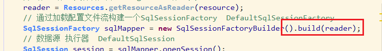
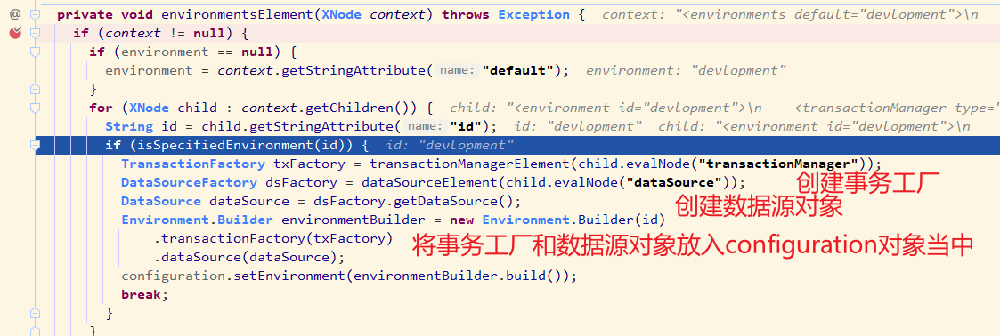

### 基本架构图


1、`mybatis` 所有的 `slq` 执行，都是基于 `Statement` 的

### 划分核心源码

`mybatis` 的核心源码，基本上可以划分为 **解析配置信息** 和 **执行SQL** 两大类

### 解析配置信息

```java
// 将XML配置文件构建为Configuration配置类
reader = Resources.getResourceAsReader(resource);
// 通过加载配置文件流构建一个SqlSessionFactory  DefaultSqlSessionFactory
SqlSessionFactory sqlMapper = new SqlSessionFactoryBuilder().build(reader);
```

其中 `getResourceAsReader` 主要获得配置文件的文件流，解析操作还是放在下面的 `build()` 方法中完成的。

跟入 `build()` 方法，继续跟入其包装方法，到最后发现本质上是创建了一个 `DefaultReflectorFactory` 对象，并且将从配置文件中获取的所有内容全部注册到这个 `Factory` 对象当中



其注入的配置类 `Configuration` 的具体内容，几乎包含了 `mybatis-config.xml` 配置文件中的所有配置项


回到上面 `build()` 方法的包装方法当中，这个配置文件的内容全部是由上面的 `XMLConfigBuilder.parser()` 方法得到

其中把从 `classpath` 加载到的配置文件转化成 `XPathParser` 对象，然后调用 `parseConfiguration()` 方法，挨个解析 `mybatis-config.xml` 配置文件里面的各个标签内容


看一个常用的 `properties` 标签如何解析的


关于事务工厂和数据源对象的创建


所有mapper的初始化解析和注册 (即我们代码里面的mapper类、或者mapper.xml)


跟进 `mapperParser.parse()` 方法，看看具体是怎么绑定 `mapper` 和生成对应的 `sql` 操作包装对象的


跟进 `configurationElement()` 方法


跟进 `buildStatmentFromContext()` 方法里面去，一路顺藤摸瓜，看到下面这个方法，看看具体的 `MapperStatement` 对象是怎么被绑定到 `sql` 语句上面


### 获取SqlSession
跟进 `SqlSessionFactory.openSession()` 方法